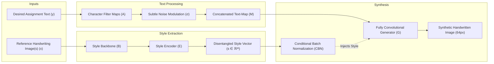

# HiGAN+ Handwriting Synthesis & Assignment Generation System

## 1. Project Overview & Verification Status

We have set up the official [HiGAN+ Repository](https://github.com/ganji15/HiGANplus) in your workspace:
- **Repository Location:** [`/home/laddu/docker/higan`](file:///home/laddu/docker/higan)
- **Virtual Environment:** [`/home/laddu/docker/higan/.venv`](file:///home/laddu/docker/higan/.venv) (Python 3.10 with PyTorch 2.14 + CUDA 13 on NVIDIA RTX 3060)
- **Pretrained Checkpoint:** [`HiGAN+/pretrained/deploy_HiGAN+.pth`](file:///home/laddu/docker/higan/HiGAN+/pretrained/deploy_HiGAN+.pth) (Generator + Style Encoder + Style Backbone)
- **Research Paper:** [`docs/papers/HiGAN_AAAI2021.pdf`](file:///home/laddu/docker/higan/docs/papers/HiGAN_AAAI2021.pdf)
  - *Title:* "HiGAN: Handwriting Imitation Conditioned on Arbitrary-Length Texts and Disentangled Styles" (AAAI 2021) & "HiGAN+: Handwriting Imitation GAN with Disentangled Representations" (ACM TOG 2022/2023)
  - *Authors:* Ji Gan, Weiqiang Wang, Jiaxu Leng, Xinbo Gao (UCAS)

---

## 2. Live Generation Verification

We verified the generation pipeline by testing arbitrary text generation (`"Hello DeepLearning Assignment ComputerVision HiGANplus Synthesized"`) using three distinct reference handwriting styles from the dataset:

### Style Sample A ("that" - Bold, rounded, upright script)

### Style Sample B ("preparation" - Fine pen, tall, light cursive)

### Style Sample C ("yours" - Slanted pencil/ballpoint script)

---

## 3. Theoretical Architecture of HiGAN+

### Key Mechanisms:
1. **Style & Content Disentanglement:**
   - Content is represented through character filter embeddings ($80+$ alphabetic/numeric/punctuation tokens).
   - Style is captured as a continuous 32-dimensional latent embedding vector $\mathbf{s}$.
2. **Variable-Length Generation & Ligatures:**
   - Characters are concatenated horizontally into a variable-length text-map $\mathbf{M}$.
   - Fully convolutional upsampling automatically blends character overlaps and produces natural cursive ligatures without manual segment stitching.
3. **PatchGAN & Contextual Loss (HiGAN+ improvements):**
   - Discriminates local patches to preserve realistic pen stroke textures, ink thickness variations, and edge nuances.
4. **CTC Recognizer Loss:**
   - Enforces that synthesized words remain legible and faithfully represent the intended text.

---

## 4. Next Step: Using Your Own Handwriting

To make the AI write your assignments in your handwriting, we have two approaches:

### Approach A: Zero-Shot Reference Style (Fastest, zero training)
1. Write a sentence or 3–5 common words on plain unlined white paper with your regular pen.
2. Take a photo or scan with good lighting (no shadows).
3. The model extracts your 32-dimensional style embedding and immediately generates any new text matching your slant, thickness, and letter shapes.

### Approach B: Fine-Tuning (Highest Accuracy & Writer Resemblance)
1. Write ~30–50 common words (or a 1-page sample containing the alphabet) on blank white paper.
2. We run an automated segmentation script to crop the words into individual images (`data/my_handwriting/<word>.png`).
3. We run the training loop (`train.py`) to fine-tune the Generator and Style Encoder on your strokes.

---

## 5. Full Assignment Page Synthesizer (To Be Built)

To turn raw word generation into realistic multi-page handwritten assignment documents:
- **Layout & Word-Wrapping:** Automatically breaks long paragraphs into lines, respecting margins.
- **Natural Human Imperfections:**
  - Micro baseline jitter (words follow natural slight undulations rather than a mechanical ruler).
  - Subtle style variation between repeated words (e.g. repeated instances of "the" have slight stroke variations).
  - Realistic word and character spacing.
- **Paper Canvas Simulation:**
  - Ruled lines (standard college-ruled / school notebook lines with red vertical margin) or blank paper.
  - Ink simulation (blue gel, black ballpoint, ink shading).
- **PDF Export:** Outputs high-resolution printable multi-page PDFs ready for submission.
